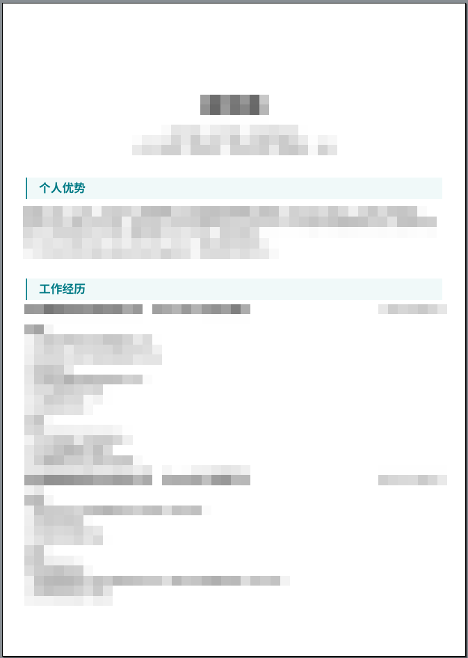

# 类 Boss 直聘风格简历模板

## 介绍

我个人比较喜欢的一个 Boss 直聘风格简历模板。由于每次生成简历还要到 Boss 上改，特别麻烦，于是自己做了一个生成模板，可以借助浏览器导出 PDF 。

## 如何使用

您可以选择克隆本仓库，然后复制 `src/config.example.ts` 为 `src/config.ts` ，并修改 `src/config.ts` 里的内容为您的信息。

您可运行 `npm run dev` 在网页里查看效果，使用快捷键 `C-p` 进行打印，注意页边距选择默认，否则页面分页会导致页面被分割。选择保存即可。

## 特性

- 支持了 Markdown 的粗体和斜体语法，理论上你可以在单行里面写 HTML 。

## 注意事项

打印页边距的修改在 `src/assets/base.css` 里，注意单位使用 `mm` 或 `cm` 。

## Example

## License

MIT
